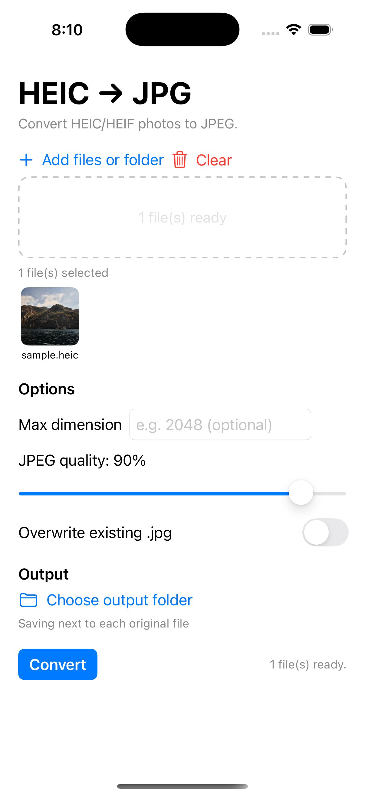
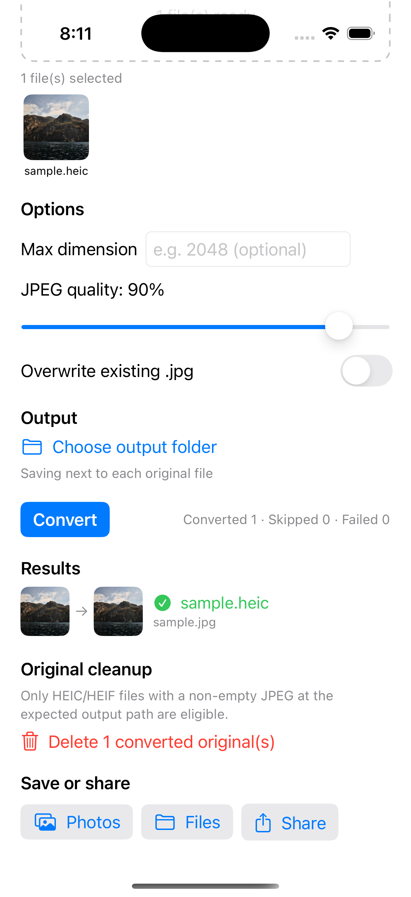

# heic-jpg

macOS에서 `HEIC`/`HEIF` 파일을 `JPEG`로 일괄 변환하는 Java 17 CLI입니다.

이 프로젝트는 당장 내 작업 흐름을 개선하는 로컬 도구를 먼저 만들고, 이후 같은 문제를 Swift 앱으로 확장하기 위한 첫 단계로 시작했습니다.

## Status

진행률: 100%

- [x] Java 17 CLI 구현
- [x] 단일 파일 변환
- [x] 디렉터리 재귀 변환
- [x] 출력 디렉터리 구조 보존
- [x] overwrite, dry-run, max-dimension 옵션
- [x] 기본 테스트 스크립트
- [x] 설치 스크립트 정리 (`scripts/install.sh`) + Homebrew formula (`Formula/`)
- [x] SwiftUI macOS/iOS 앱 확장 (`swift-app/`)
- [x] iOS 사진 앱/Files 저장 및 공유 시트
- [x] 앱 원본 정리 UI와 변환 전후 썸네일
- [x] 변환 전후 스크린샷 추가

릴리스: `v0.1.0` 태그와 Homebrew formula sha256 확정 완료

## Why

- 아이폰 사진이 `HEIC`라서 GPT 업로드나 일부 웹 서비스에서 바로 처리되지 않는 경우가 있음
- 우선 내가 가장 빨리 쓰기 편한 형태는 macOS용 로컬 CLI임
- 포트폴리오 관점에서는 `Java`로 문제를 먼저 해결하고, 이후 `Swift`로 사용자 범위를 넓히는 흐름을 남기고 싶었음

## Features

- 단일 파일 또는 디렉터리 입력 지원
- 디렉터리 입력 시 하위 폴더까지 재귀 탐색
- `--output-dir` 지정 시 디렉터리 구조 보존
- 이미 존재하는 `.jpg` 파일은 기본적으로 건너뜀
- `--overwrite`로 기존 출력 덮어쓰기
- `--dry-run`으로 실제 변환 없이 작업 계획 확인
- `--max-dimension`으로 긴 변 기준 리사이즈
- `--delete-converted`로 검토 후 짝 `.jpg`가 있는 원본 `HEIC`만 영구 삭제 (삭제 전 확인)

SwiftUI 앱은 같은 탐색·출력·건너뛰기 규칙을 사용하며 다음 기능을 추가로 제공합니다.

- 변환 전후 썸네일 비교
- iOS 사진 앱 저장, Files 내보내기, 시스템 공유 시트
- 짝 JPEG가 존재하고 비어 있지 않은 원본만 확인 후 삭제

## Screenshots

| 변환 전 | 변환 후 |
|---|---|
|  |  |

## Requirements

- macOS
- JDK 17+
- `sips` 사용 가능 환경

이 도구는 실제 이미지 변환 엔진으로 macOS 내장 명령인 `sips`를 사용합니다.

## Quick Start

빌드:

```bash
./scripts/build.sh
```

설치(전역 명령으로 등록):

```bash
./scripts/install.sh          # ~/.local/bin 에 heic-jpg, heic-jpg-ui 링크
```

설치/배포 방법은 [docs/INSTALL.md](docs/INSTALL.md) 참고 (설치 스크립트 + Homebrew formula).

실행:

```bash
./heic-jpg ~/Pictures/IMG_0001.HEIC
./heic-jpg ~/Pictures/iPhone
./heic-jpg ~/Pictures/iPhone --output-dir ~/Pictures/converted
./heic-jpg ~/Pictures/iPhone --output-dir ~/Pictures/converted --max-dimension 2048
./heic-jpg ~/Pictures/iPhone --dry-run
```

UI 실행:

```bash
./heic-jpg-ui
```

더블클릭 가능한 macOS 앱 만들기:

```bash
./scripts/build-app.sh
open "build/HEIC JPG.app"
```

변환 결과를 직접 검토한 뒤, 짝 `.jpg`가 있는 원본 `HEIC`만 정리:

```bash
# 1) 변환
./heic-jpg ~/Pictures/iPhone --output-dir ~/Pictures/converted
# 2) 결과를 눈으로 검토
# 3) 변환 때와 같은 인자로 원본 정리 (삭제 전 y/N 확인)
./heic-jpg ~/Pictures/iPhone --output-dir ~/Pictures/converted --delete-converted
```

`--delete-converted`는 짝 `.jpg`가 실제로 존재하고 비어있지 않은 `HEIC`만
영구 삭제합니다. 삭제 대상 목록을 먼저 보여주고 `y`를 입력해야 실행합니다.

## CLI Options

```text
Usage:
  heic-jpg [options] <file-or-directory>...

Options:
  -o, --output-dir <dir>    Write converted files under <dir>.
                            File inputs go directly under <dir>.
                            Directory inputs preserve the input root name.
      --overwrite           Replace existing .jpg targets.
      --dry-run             Print the planned work without converting files.
      --max-dimension N     Resize the longest edge to N pixels before saving.
      --delete-converted    Permanently delete HEIC/HEIF inputs that already
                            have a matching .jpg. Prompts before deleting.
  -h, --help                Show this help.
```

## Project Layout

- `src/main/java/` : CLI와 변환 로직
- `src/test/java/` : 외부 라이브러리 없이 실행하는 기본 테스트
- `scripts/build.sh` : `javac` 기반 빌드
- `scripts/install.sh` / `scripts/uninstall.sh` : 로컬 설치/제거
- `scripts/test.sh` : 컴파일 및 테스트 실행
- `Formula/heic-jpg.rb` : Homebrew formula (tap 배포용)
- `swift-app/` : SwiftUI macOS/iOS 앱 (ImageIO 기반 공유 코어)
- `docs/ARCHITECTURE.md` : 설계 의도와 Swift 확장 계획
- `docs/INSTALL.md` : 설치/배포 가이드

## Development

테스트 실행:

```bash
./scripts/test.sh
```

## Next Step

Java CLI로 문제를 먼저 닫고, 같은 입력/출력 규칙을 SwiftUI macOS/iOS 앱으로 확장했습니다.
앱은 macOS 전용 `sips` 대신 ImageIO 기반 공유 코어를 써서 두 플랫폼에서 동일하게 동작합니다.
빌드 방법은 [swift-app/README.md](swift-app/README.md) 참고.

앱 기능과 검증은 완료했습니다. 첫 릴리스 태그 `v0.1.0`과 Homebrew formula sha256도
확정했습니다. 외부 배포 시에는 `Formula/heic-jpg.rb`를 tap 저장소에 복사해 게시합니다.
